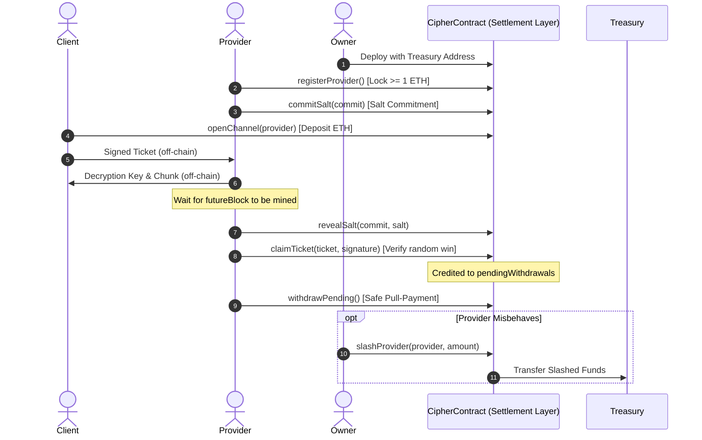

# Cipher Settlement Protocol

Built with Foundry | Solidity 0.8.24 

This repository implements the settlement layer that handles the money, payment channels, staking, and lottery-based micropayments for the protocol. All core functionalities are consolidated within a single contract, `Contract.sol` (containing `CipherContract`), optimized for gas efficiency, lower deployment costs, and simpler state management.

---

## Core Architecture & Features

The contract handles three main responsibilities:

### 1. Provider Registration & Staking (Identity & Security)
*   **Staking Requirement**: Anyone wishing to act as a provider must stake at least `1 ETH` via `registerProvider()`.
*   **Provider Slashing**: If a provider behaves maliciously, the contract owner can call `slashProvider(address provider, uint256 amount)` to slash their stake and transfer the funds to a configured `treasury` address.
*   **Unbonding Period**: Unstaking requests (`requestUnstake()`) are subject to an unbonding period of `7200 blocks` (~24 hours) to prevent exit scams, after which providers can withdraw their stake via `withdrawStake()`.

### 2. Payment Channel Management (Double-Buffered Exits)
*   **Channel Lifecycle**: Clients open a channel using `openChannel(provider)` and lock ETH deposits. Each channel uniquely pairs one client with one provider.
*   **Channel Closure & Disputes**: Either party can call `closeChannel(channelId)`. This locks the channel and schedules the final payout withdrawal after a delay consisting of the `unbondingPeriod` (7200 blocks) and a `disputePeriod` (3600 blocks). This combined delay ensures providers have ample time to submit outstanding winning tickets.
*   **Fund Withdrawal**: After the unlock block passes, clients can call `withdrawChannel(channelId)` to claim any remaining, unclaimed deposits.

### 3. Probabilistic Micropayment Settlement (Safe Pull-Payments)
*   **Randomness & Ticket Claims**: Clients sign tickets off-chain. Providers submit winning tickets on-chain using `claimTicket()`. Randomness is derived via a secure commit-reveal scheme utilizing blockhashes and pre-committed salts.
*   **Anti-Drain Safety Cap**: A single ticket payout is capped at `25%` of the channel's available balance to prevent accidental or malicious draining of channel capital.
*   **Enhanced Replay Protection**: Each ticket generates a unique internal nullifier hashing critical details: `chainid`, `address(this)`, `channelId`, `client`, `provider`, `amount`, `nonce`, and `futureBlock`.
*   **Safe Pull-Payment Model**: Winning ticket payouts are not sent directly; they are credited to the provider's `pendingWithdrawals` mapping. Providers call `withdrawPending()` to safely pull their funds, preventing reentrancy attacks.
*   **Reentrancy Protection**: Standardized via OpenZeppelin's `ReentrancyGuard`.

---

## Protocol Workflow (Step-by-Step)

### Flow Walkthrough:
1.  **Deployment**: The contract is initialized with a secure `treasury` address to receive slashed funds.
2.  **Provider Registration**: The provider locks at least `1 ETH` in the contract using `registerProvider()`.
3.  **Salt Commitment**: Off-chain, the provider picks a secret `salt` and hashes it. On-chain, they submit this hash via `commitSalt()`. This commitment must occur *before* the client signs any tickets targeting that block.
4.  **Micropayment Tickets**: The client requests a file chunk. The provider encrypts the chunk and sends it with a proof. The client validates the proof and sends a signed `Ticket` to the provider containing:
    *   `channelId`
    *   `client` and `provider` addresses
    *   The payout `amount`
    *   A unique `nonce`
    *   A target `futureBlock`
    *   A winning probability `winProbab`
    *   The provider's `saltCommit`
5.  **Key & Salt Reveal**: Once the `futureBlock` is mined, the provider reveals their secret salt pre-image on-chain via `revealSalt()`.
6.  **Claiming Wins**: If the ticket is a winner (calculated as `uint256(keccak256(blockhash(futureBlock), salt, nullifier)) % 100 < winProbab`), the provider submits the ticket and signature to `claimTicket()`.
7.  **Pull-Payment Settlement**: If the claim is valid, the contract credits the payout to the provider's `pendingWithdrawals` mapping.
8.  **Withdrawal**: The provider calls `withdrawPending()` to retrieve their accumulated payouts.

---

## How the Randomness & Salt Timing Works

We use a two-step commit-reveal scheme:
1.  **Commit**: First, the provider picks a secret salt, hashes it, and submits the hash (`commitSalt`) to the contract. The provider is now locked in — they cannot change their salt later.
2.  **Reveal**: Once the target block is mined and its blockhash is public, the provider reveals their salt (`revealSalt`). The contract checks that the hash matches the commitment and verifies the salt was committed *before* the target block was mined.
3.  **Why Salt Timing Matters**: If a provider could wait until after the block was mined to commit their salt, they could try thousands of salts off-chain until they found one that made the ticket win. By enforcing `saltCommitBlock[ticket.saltCommit] < ticket.futureBlock`, the provider cannot predict the blockhash or manipulate the lottery outcome.

---

## Key Developer Notes
*   **Hinglish Code Comments**: Inline comments in `Contract.sol` are written in Hinglish to help Indian developers understand the logic behind EVM lookbacks, reentrancy guards, and unbonding lock resets quickly.
*   **Verification**: Run automated tests via `forge test` to verify complete protocol execution.
